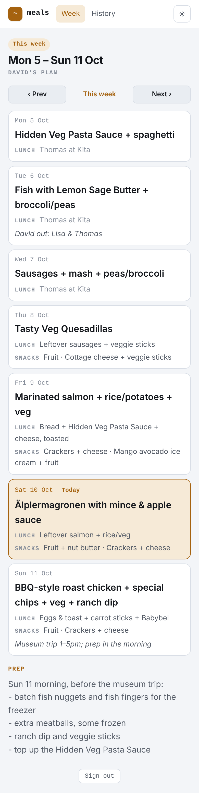
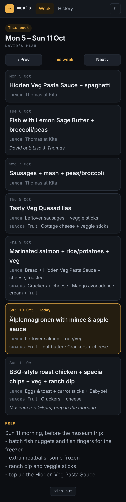
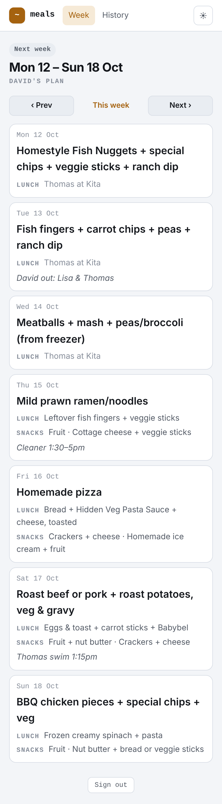
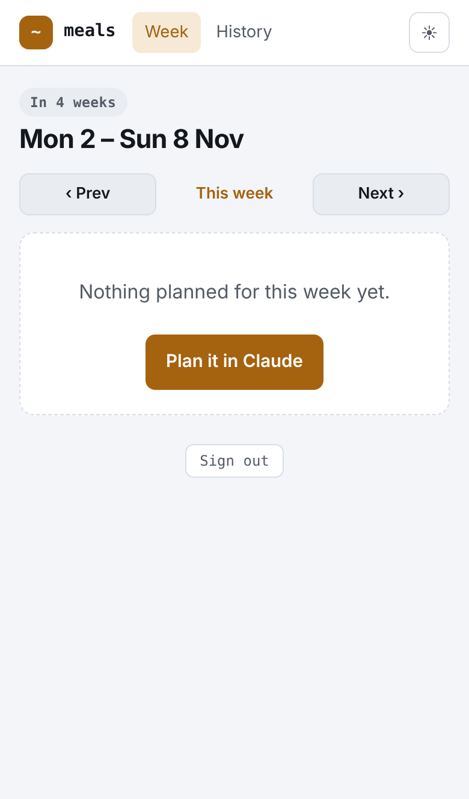
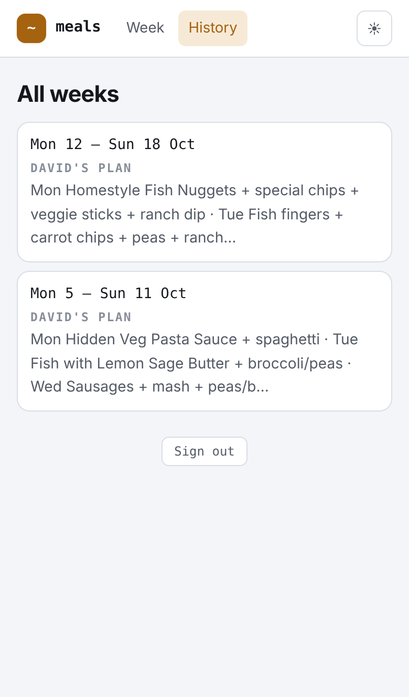
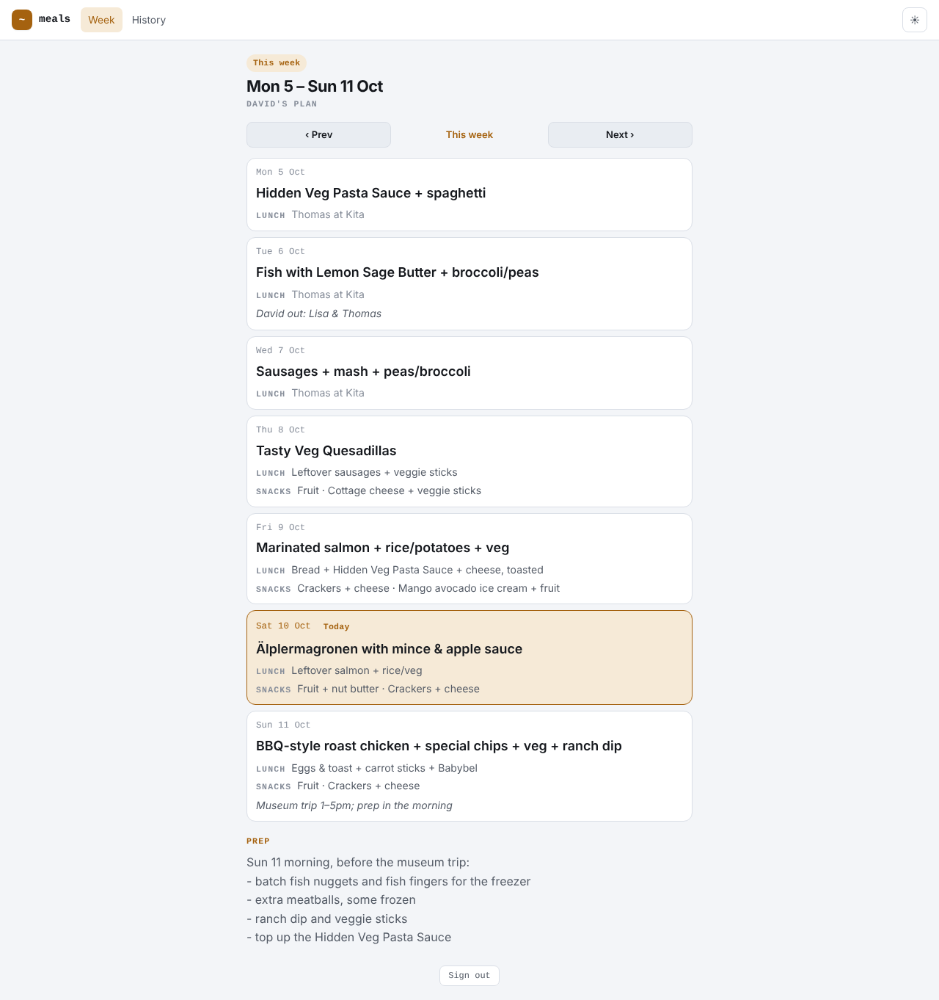
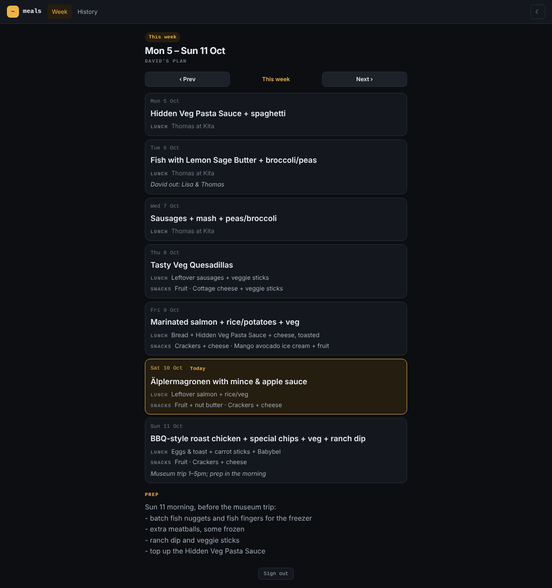
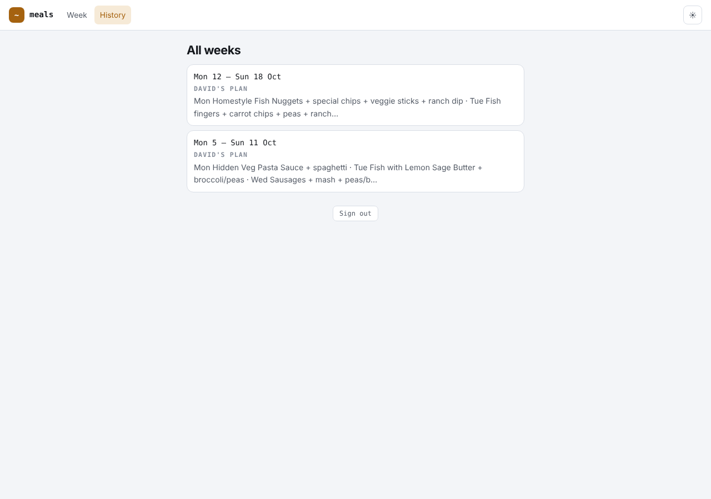

# Walkthrough

A tour of the Meal Planner from the family's side: how plans get in, and what
you see at **[meals.winterbottom.xyz](https://meals.winterbottom.xyz)**. For
setup and internals, see the [README](README.md).

The screenshots use the two example weeks the app seeds into an empty
database, taken on Saturday 10 October 2026.

## 1. Plans go in through Claude

There is no editing in the viewer. A week gets planned in a claude.ai chat with
the **Meal Planner**, **Cozi** and **Flatnotes** connectors enabled:

1. Ask Claude to "plan the next 2 weeks". It reads the recent weeks and the
   household rules, checks the Cozi calendar, and drafts both weeks in a table.
2. Go back and forth until it's right. Claude doesn't save until you say the
   plan is agreed.
3. Claude saves each week with `save_week_plan`. The viewer shows it straight
   away.

Lisa's plans work the same way: send Claude the WhatsApp photo and ask it to
"save Lisa's plan". [`docs/how-to-use.md`](docs/how-to-use.md) has the
instructions to paste into the chat or Project.

## 2. Open it on the phone

Open the URL and sign in with your Microsoft account. Only addresses on the
allow-list get in, and the sign-in lasts a year. Then add it to the home screen:

- **iPhone (Safari):** Share → **Add to Home Screen**
- **Android (Chrome):** ⋮ → **Install app**

It opens full screen on the current week.

## 3. This week

<p>
  
  
</p>

- The badge says which week you're looking at ("This week", "Next week", "In 4
  weeks"). Under the heading it says whose plan it is: David's or Lisa's.
- Each day's dinner is the big line. Lunch and snacks sit underneath, and
  Mon–Wed Kita lunches read "Thomas at Kita".
- **Today** is highlighted.
- Notes for the day (who's out, trips) are in italics. The week's **Prep** list
  is below Sunday.
- On a Sunday, `/` still shows the week that's ending, so the prep list is
  there on prep day.
- Light or dark follows the phone. The button at the top right switches it.

## 4. Other weeks

**Prev** and **Next** move a week at a time, and **This week** jumps back. On a
phone you can also swipe left or right; a mostly vertical swipe still just
scrolls.

<p>
  
  
</p>

A week with nothing planned says so, with a **Plan it in Claude** button that
opens a new claude.ai chat.

Any week has its own address, `/week/YYYY-MM-DD`. Any date in the week works
and redirects to that week's Monday, so a link can be shared in WhatsApp.

## 5. History

**History** lists every stored week, newest first, with whose plan it was and a
preview of the dinners. Tap a week to open it.



## 6. On a computer

The same pages work in a desktop browser. The layout keeps a phone-width
column in the middle of the screen.







## 7. Signing out

**Sign out** is at the bottom of every page. To shut someone out, remove
their address from the allow-list in docker-infra. That takes effect on
their next page load, even on a phone that is already signed in.

## Updating the screenshots

Start the app locally on an empty database (README, "Run locally"), then run:

```bash
npm run screenshots
```

The script is [`scripts/take-screenshots.mjs`](scripts/take-screenshots.mjs).
`/` follows today's date, so the "this week" shots show whichever example week
contains today.
